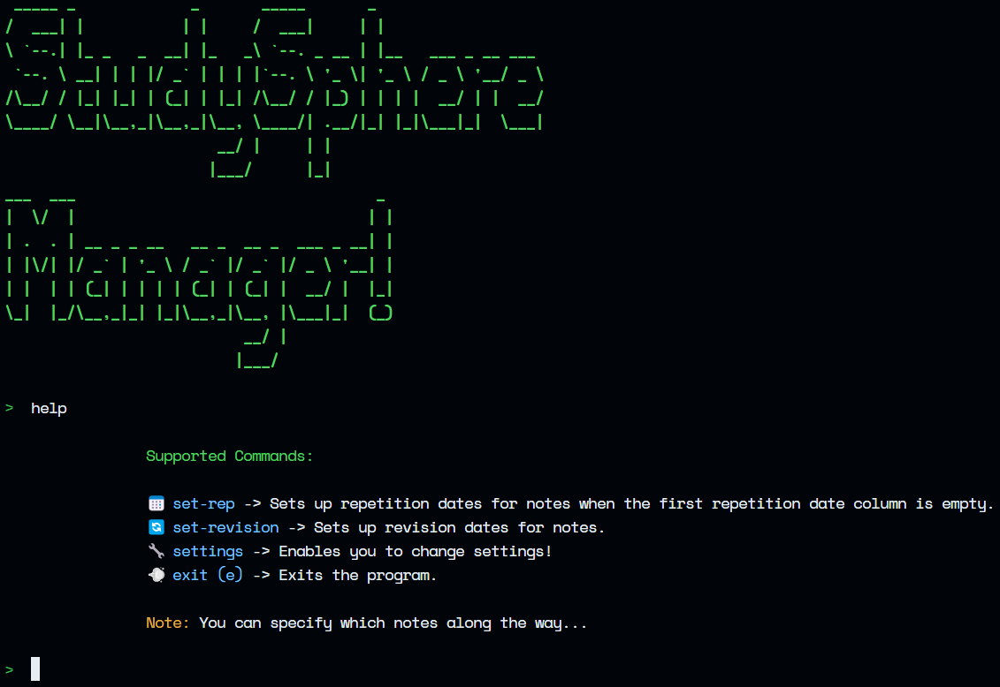

<!-- PROJECT LOGO -->
 

  

<h3 align="center"> StudySphere </h3>

  

     Streamline your study journey with this open-source Notion template, integrating scientifically-backed techniques for maximum effectiveness. 
     
    <a href="https://github.com/SenaThenu/StudySphere/issues">Report a Bug  or Request a New Feature</a>
  

<!-- PROJECT SHIELDS -->

  
  
  
  
  
  

<!-- Access to the Notion Template -->

  

<!-- TABLE OF CONTENTS -->
## Table of Contents 

-   [About The Project ](#about-the-project-)
    -   [Built With ](#built-with-)
-   [Getting Started ](#getting-started-)
    -   [Prerequisites ](#prerequisites-)
-   [Usage ](#usage-)
    -   [How the Template Works](#how-the-template-works)
    -   [How the Program Works](#how-the-program-works)
-   [Roadmap ](#roadmap-️)
-   [Contributing ](#contributing-)
-   [Current Contributors ](#current-contributors-️)
-   [Contact ](#contact-)
-   [Acknowledgments \w ](#acknowledgments-w-)

<!-- ABOUT THE PROJECT -->
## About The Project 

Elevate your study game with this open-source Notion template—it's like having a personal study cheerleader! This template embraces the science-backed power of Active Recall and Spaced Repetition, all while adding a dash of fun with a traffic light system that guides your way.

The best part? Our trusty `manager.py` script automates the whole process kicking your friction in the butt! It's all about working smart, not hard, in this nonprofit study revolution!

<a href="#readme-top">Jump to Top</a>

### Built With 

<a href="#readme-top">Jump to Top</a>

<!-- GETTING STARTED -->

## Getting Started 

To get started, download the code using any of the methods as shown below. (To get this, click on "Code" on the top-right)

  

### Prerequisites 

1.  You have to duplicate the StudySphere Notion Template (unless you wanna create one from scratch :) Download it by following this [link](https://senathenu.notion.site/2428547d9c0f45c48fa0b4018fec3e54?v=92e0d0c8a4c44bd7ba1acd1d67b7b1d0&pvs=4)!

2.  Make sure Python is installed on your computer! You can install it via [Python Official Website](https://www.python.org/)!

3.  Afterwards, to run the trusty `manager.py` program, you need to install some third-party packages. So, open the terminal in the folder where you have the downloaded code. Then run,

        `pip install -r requirements.txt`

Then, follow the instructions of the following video...

https://github.com/SenaThenu/StudySphere/assets/98274844/ba3ff31b-cd75-4348-a456-2fa6089cdecb

<a href="#readme-top">Jump to Top</a>

<!-- USAGE EXAMPLES -->

## Usage 

### How the Template Works

Basically, it's a database where you can store your class/lecture notes divided into main subjects/topics (or whatever you wanna call them). To keep things simple, we call them branches!

Every note you store in the StudySphere is associated with 3 Repetition Interval Columns (Rep 1, Rep 2, Rep 3) for you to store spaced repetition dates and 3 Repetition Rates columns to rate how confident you felt (green, yellow, red).
> Of course, you can add more... Just make sure to update the settings!

Based on your ratings, your strength is calculated regarding the content in that note. So, all the notes are sorted according to the strength. 

Then, there is a Revision Rep Column to perform revision on the notes when you have an exam ahead.

### How the Program Works

Instead of letting you manually set spaced repetition and revision dates (which is dreadful), it automatically sets them.

_Note: this is just what it is capable of currently..._

Yet, as a community, especially during this Hacktoberfest, we can extend it further. We all (including you) power up this! So, why are you waiting? Go ahead... It's okay to make mistakes. We all are learning _forever!_

<a href="#readme-top">Jump to Top</a>

#### User Settings
| Setting | Description | Default |
| ------- | :-: | :---: |
| API_KEY |  Your API Key. Watch the above video for help! | Nothing :O |
| StudySphere_ID | The Database ID of the StudySphere. | Nothing :O |
| Instructions | Whether instructions should be displayed or not. | True |
| Rep_Col_Names | A name list of all columns which store spaced repetition dates. | Rep 1, Rep 2, Rep 3 |
| Rep_Intervals | A list of Spaced Repetition intervals in days. | 7, 21, 60 |
| Notes_Title_Col_Name | The column name which stores the names of notes stored in a branch! | Lesson |
| Revision_Col_Name | Name of the column which stores revision dates! | Revise Rep |

> [!Note]
> You don't have to deal with Col_Names as long as you stick to the template :)

<!-- ROADMAP -->

## Roadmap 

I have listed some unaccomplished features you can start working on. Plus, you can even make a non-code contribution to Hacktoberfest by adding more features to this roadmap!

-   [x] Automatic Spaced Repetition Dates Setter 
-   [x] Automatic Revision Scheduler 
    -   [ ] Smart Revision Setter - Setting revision for notes whose strength is below a specific limit. 
    -   [ ] Individual Date Selection for Each Note 
-   [x] Flexible Parameters that can be modified using setting) 

See the [open issues](https://github.com/SenaThenu/StudySphere/issues) for a full list of proposed features (and known issues).

<a href="#readme-top">Jump to Top</a>

<!-- CONTRIBUTING -->

## Contributing 

Welcome Code Wizards & Witches!  Your contributions fuel  this repo!!!
 
_Let's show the power  of Open-Source!_

    
Why are open-source developers the sweetest folks in tech? 

    
 Because they believe in sharing not only code but also <i>smiles </i> and <i>love </i> through 0s and 1s!

 

-   Ways to Contribute 

    -   [Open Issues](https://github.com/SenaThenu/repo_name/issues)
    -   [Update Readme](https://github.com/SenaThenu/repo_name/blob/main/README.md)
    -   [Make the Logo and the Assets Cooler](https://github.com/SenaThenu/repo_name/tree/main/slides)
    -   Introduce an **_awesome feature_** 

        1. Fork the Project 
        2. Create your Feature Branch (`git checkout -b my_awesome_feature_branch`)
        3. Commit your Changes (`git commit -m 'Add some awesome features'`)
        4. Upstream this repository (`git remote add origin https://github.com/SenaThenu/StudySphere.git`)
        5. Push to the Main Branch of this repo (`git push origin my_awesome_feature_branch`)
        6. Open a Pull Request 

        > If you want help with Git check out this Fireship video: [Git It!](https://www.youtube.com/watch?v=HkdAHXoRtos)

<a href="#readme-top">Jump to Top</a>

## Current Contributors 

This wouldn't exist if it weren't for these developers! **_Our Gratitude!!!_** ([emoji key](https://allcontributors.org/docs/en/emoji-key)): 

> "Even when I lose, I'm winning \
> 'Cause I give you all of me \
> And you give me all of you" \
> _~ All of Me - John Legend_

<!-- ALL-CONTRIBUTORS-LIST:START - Do not remove or modify this section -->
<!-- prettier-ignore-start -->
<!-- markdownlint-disable -->
<table>
  <tbody>
    <tr>
      <td align="center" valign="top" width="14.28%"><a href="http://senathenu.github.io"> <b>Senash Thenuja</b></a> <a href="#code-SenaThenu" title="Code">💻</a> <a href="#doc-SenaThenu" title="Documentation">📖</a> <a href="#eventOrganizing-SenaThenu" title="Event Organizing">📋</a></td>
    </tr>
  </tbody>
</table>

<!-- markdownlint-restore -->
<!-- prettier-ignore-end -->

<!-- ALL-CONTRIBUTORS-LIST:END -->

<!-- ACKNOWLEDGMENTS -->

## Acknowledgments \w 

-   [Logo - Created by Freepik (on Flaticon)](https://www.flaticon.com/free-icon/world-book-day_4212483?term=world+book+day&page=1&position=8&origin=search&related_id=4212483)
-   [Documentation Template](https://github.com/othneildrew/Best-README-Template)
-   [G.R.O.W. Revision Method - Cajun Koi Academy](https://www.youtube.com/watch?v=N60JDe3a0IM)
-   [Ali Abdaal's Spaced Repetition Article](https://aliabdaal.com/spaced-repetition/)
-   [3D Animated Microsoft Style Emojis](https://animated-fluent-emoji.vercel.app/)

<a href="#readme-top">Jump to Top</a>

